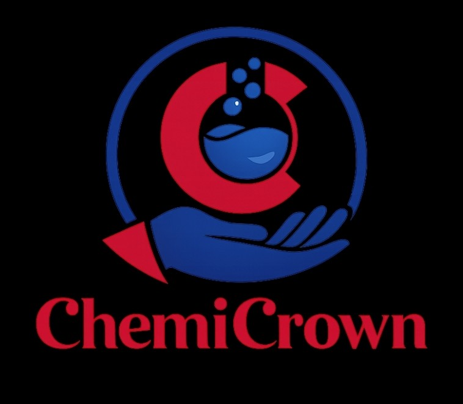

<div align="center">
  
  <h1>ChemiCrown CDMS</h1>
  <p><strong>A Modern Chemical Distribution Management System</strong></p>
  
  <p>
    
    
    
    
    
    
    
  </p>
</div>

---

## 📖 Overview

**ChemiCrown CDMS** is a comprehensive internal management and customer-facing portal built to digitize operations for wholesale industrial chemical distributors. It modernizes manual workflows by unifying **Inventory Management**, **Customer Ordering Pipelines**, **Live Chat Support**, and **Human Resources (Attendance & Payroll)** under one secure, real-time application.

## ✨ Key Features

- **🛍️ Public & Customer Portal**
  - Fully responsive, beautifully designed product catalog.
  - Shopping Cart, Wishlist, and Checkout system.
  - Personal Order History tracking.
  
- **📦 Inventory & Stock Management**
  - Full CRUD for products, categories, and bulk inventory logic.
  - Automated low-stock alerts and threshold monitoring.
  - Material Safety Data Sheets (MSDS) & storage instruction tracking.

- **💼 Sales & Order Pipeline**
  - Role-based pipeline (Requested → Pending → Processing → Packaged → Dispatched → Delivered).
  - Razorpay UPI Payment verification.
  - Sales & Finance analytical dashboard with Recharts.

- **👥 Human Resources Module**
  - Track Employee Attendance, Leaves, and Overtime visually via calendar UI.
  - Generate automated Monthly Payslips factoring in incentives and deductions.
  - Admin view for managing company staff and RBAC (Role-Based Access Control) permissions.

- **⚡ Real-time & System Utilities**
  - Real-time Notifications & Live Support Chat powered by `Socket.io`.
  - Comprehensive Audit Logs and an internal "Recycle Bin" for soft-deleted entities.
  - Zod data validation, Helmet security headers, and JWT Authentication.

## 🛠️ Tech Stack

### Frontend
- **Framework:** React 19 + Vite
- **Styling:** Tailwind CSS v4, Framer Motion (micro-animations), `lucide-react` (icons)
- **Routing & State:** React Router DOM v7, SWR (data fetching)
- **Data Viz & Utilities:** Recharts, Leaflet (maps), `react-hot-toast`

### Backend
- **Core:** Node.js, Express.js
- **Database & ORM:** PostgreSQL, Prisma ORM (v6)
- **Real-time & Security:** Socket.io, JWT (jsonwebtoken), Bcryptjs, Zod
- **3rd-Party Integrations:** Cloudinary (image hosting), Nodemailer (emails), Razorpay (payments)

## 🚀 Getting Started

### Prerequisites
- Node.js (v18+ recommended)
- PostgreSQL (local or remote instance)
- API Keys for Cloudinary, Razorpay, and an SMTP email service.

### Installation

1. **Clone the repository:**
   ```bash
   git clone <your-repo-url>
   cd ChemiCrown-cdms
   ```

2. **Backend Setup:**
   ```bash
   cd backend
   npm install
   ```
   - Duplicate `.env.example` to `.env` and fill in your `DATABASE_URL`, `JWT_SECRET`, and API keys.
   - Run database migrations and seed the database:
     ```bash
     npx prisma migrate dev
     node prisma/seed.js
     node seed-holidays.js
     ```
   - Start the server:
     ```bash
     npm run dev
     ```

3. **Frontend Setup:**
   ```bash
   cd ../frontend
   npm install
   ```
   - Create a `.env` file referencing your backend URL:
     ```env
     VITE_API_URL=http://localhost:5000
     ```
   - Start the dev server:
     ```bash
     npm run dev
     ```

## 🔒 Access Control (RBAC)
The system leverages a strict internal Role system to toggle UI components and lock down API routes:
- `SUPER_ADMIN`, `OWNER`: Full system & financial access.
- `MANAGER`: Overlooks HR, Inventory, and overall operations.
- `SALES`, `MARKETING`: Customer verification, quotation handling, and order advancing.
- `INVENTORY_MANAGER`: Exclusive access to stock modification and supplier tracking.
- `CUSTOMER`: Limited public access + Personal Cart/Wishlist/Order History.

## 🤝 Contributing
Built by the dedicated Internship Team. Refer to the `docs/` folder for internal Project Charters, Entity-Relationship Diagrams, and Architecture flows.

---
*Powered by ChemiCrown - Distributing Excellence.*
