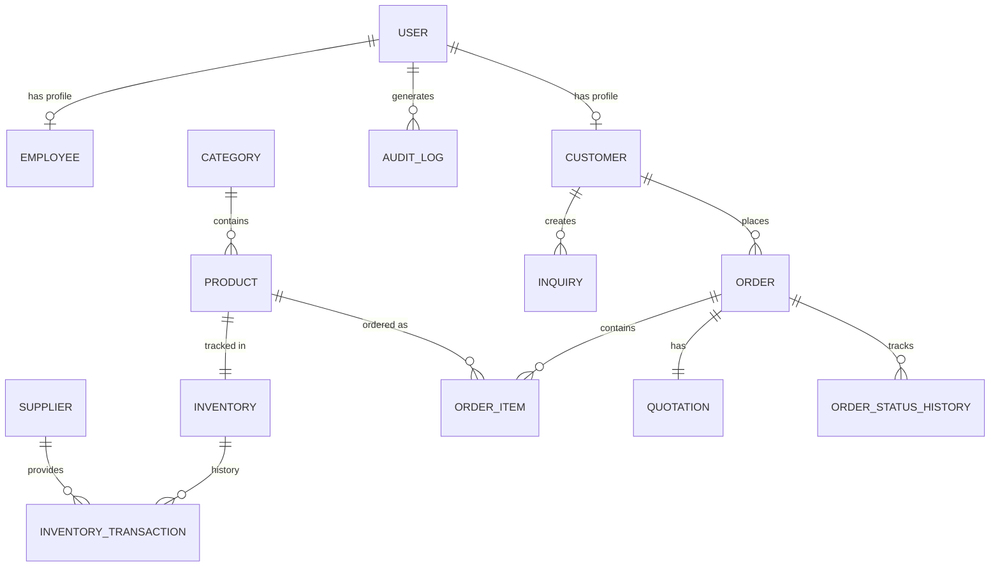

# Entity Relationship (ER) Diagram

```mermaid
erDiagram
    USER ||--o| EMPLOYEE : "has profile"
    USER ||--o| CUSTOMER : "has profile"
    USER ||--o{ AUDIT_LOG : "generates"
    
    CATEGORY ||--o{ PRODUCT : "contains"
    PRODUCT ||--|| INVENTORY : "tracked in"
    INVENTORY ||--o{ INVENTORY_TRANSACTION : "history"
    SUPPLIER ||--o{ INVENTORY_TRANSACTION : "provides"
    
    CUSTOMER ||--o{ INQUIRY : "creates"
    CUSTOMER ||--o{ ORDER : "places"
    
    ORDER ||--o{ ORDER_ITEM : "contains"
    PRODUCT ||--o{ ORDER_ITEM : "ordered as"
    
    ORDER ||--|| QUOTATION : "has"
    ORDER ||--o{ ORDER_STATUS_HISTORY : "tracks"
```
