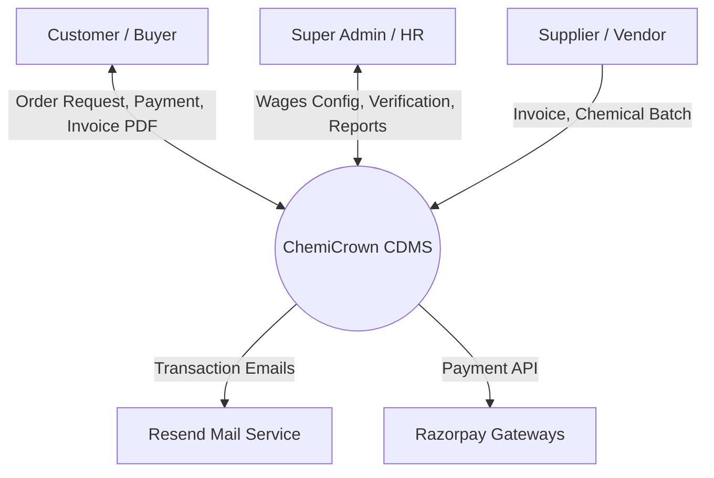
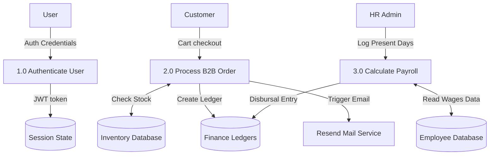
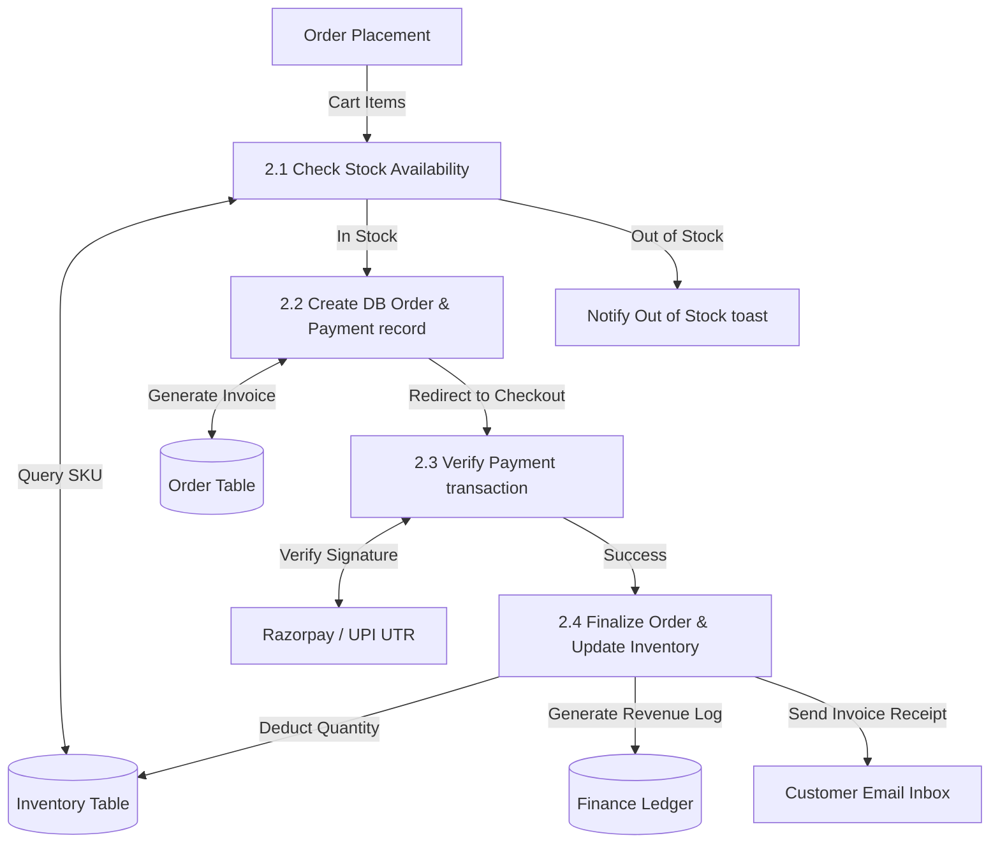
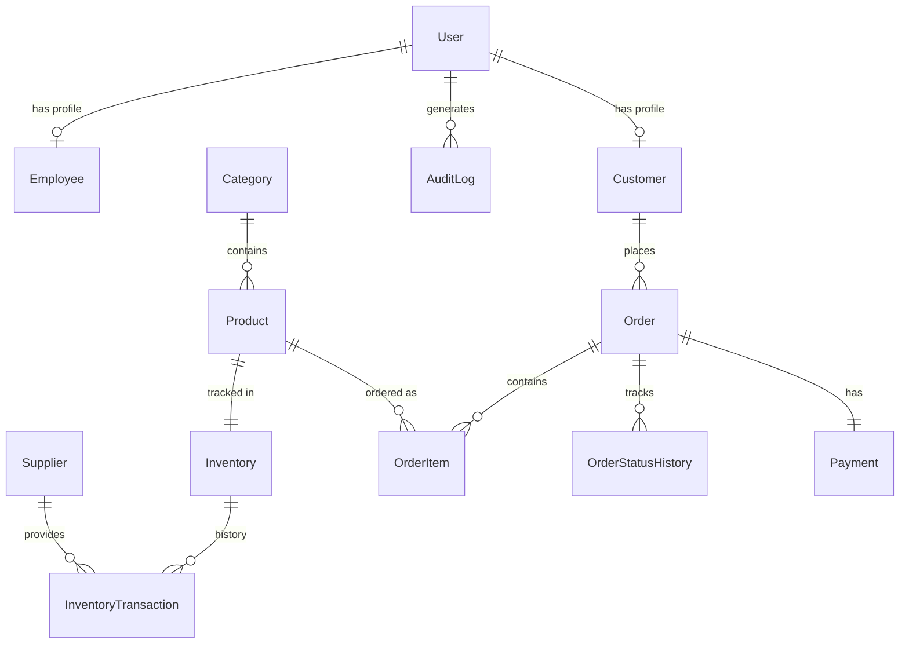

# CHEMICROWN CDMS — FINAL PROJECT REPORT

## Certificate

This is to certify that the project report entitled **"CHEMICROWN CHEMICAL DISTRIBUTION MANAGEMENT SYSTEM (CDMS)"** is a bonafide work carried out by the software engineering team during the 6-week internship program at **ChemiCrown, Bhavnagar, Gujarat**, under the supervision of corporate and technical mentors.

**Mentors:**
* Narendrasinh Solanki (Founder & Director, ChemiCrown)

**Development Team:**
* Project Lead & Full-Stack Architect
* Frontend Engineer
* Backend & HRMS Integration Specialist

---

## Acknowledgement

We express our deep gratitude to **Narendrasinh Solanki** and the management of **ChemiCrown** for providing the opportunity to develop the Chemical Distribution Management System (CDMS) during our internship. The hands-on experience in understanding wholesale industrial distribution supply chains, compliance requirements, and payroll challenges was invaluable.

We also thank our academic advisors and peers for their continuous feedback throughout the sprint reviews.

---

## Abstract

**ChemiCrown CDMS** is a specialized Enterprise Resource Planning (ERP) and B2B eCommerce portal designed for chemical wholesaling and distribution. Operating in a high-compliance industry like industrial chemical supply demands strict tracking of safety datasheets (SDS/MSDS), chemical batch safety compliance, and precise lot traceability, coupled with complex business transactions.

The project replaces traditional Excel-based tracking with a modern **React + Vite** single-page application (SPA) frontend and a **Node.js + Express.js** backend utilizing **Prisma ORM** and **PostgreSQL (Supabase)**. During the 6-week internship, the team successfully developed and deployed a multi-role Role-Based Access Control (RBAC) portal, an interactive purchase order pipeline with integrated Razorpay and direct UPI tracking, double-entry bookkeeping ledgers, and a comprehensive positive-accumulation HRMS payroll engine.

---

## List of Figures
1. Figure 1.1: ChemiCrown Corporate Communication Hierarchy
2. Figure 1.2: System Architecture Diagram (React, Express, PostgreSQL, External APIs)
3. Figure 2.1: Context Diagram (Level 0 DFD)
4. Figure 2.2: First Level Data Flow Diagram (DFD)
5. Figure 2.3: Second Level Data Flow Diagram (DFD) - Order Processing & Inventory Deductions
6. Figure 3.1: System Flow Diagram
7. Figure 3.2: Entity-Relationship (ER) Diagram (Mermaid Representation)
8. Figure 5.1: Profile Swapper Menu & Account Switcher Interface
9. Figure 5.2: Product Details & GHS Printing Modal Screen
10. Figure 5.3: Payroll Payment & Custom Letterhead Receipt Print Screen

---

## List of Tables
1. Table 1.1: Minimum Hardware & Software Environments
2. Table 2.1: Feasibility Analysis Summary Matrix
3. Table 3.1: User Table Schema Data Dictionary
4. Table 3.2: Employee Table Schema Data Dictionary
5. Table 3.3: Customer Table Schema Data Dictionary
6. Table 3.4: Product Table Schema Data Dictionary
7. Table 3.5: Order Table Schema Data Dictionary
8. Table 3.6: Payment Table Schema Data Dictionary
9. Table 3.7: FinanceLedger Table Schema Data Dictionary

---

# CHAPTER 1: Introduction & Project Overview

## 1.1 About the Company

### 1.1.1 Introduction of the Company
**ChemiCrown** is an established industrial chemical wholesaler and distributor based in Bhavnagar, Gujarat, India. Located in the Madhav Industrial Park, Vartej, the company acts as a vital bridge between chemical manufacturers and regional industrial consumers (including textile factories, paint manufacturers, plastics processors, and metal refineries). ChemiCrown's core business involves purchasing bulk solvents, thinners, and chemical compounds, packaging them into standardized drums, barrels, or carboys, and distributing them to regional B2B buyers.

### 1.1.2 Quality Policy
ChemiCrown is committed to the highest standards of safety, quality, and regulatory compliance. Handling hazardous substances requires precise adherence to government guidelines, transport regulations, and chemical safety protocols. The company enforces strict Quality Assurance (QA) checks on incoming bulk chemicals, ensures all distributed batches carry authentic Certificates of Analysis (CoA), and matches packaging with GHS (Globally Harmonized System of Classification and Labelling of Chemicals) labels.

### 1.1.3 Communication
Corporate communication at ChemiCrown operates on an operations-led structure. The founder and administrators direct operations, sales staff manage client communications, inventory managers oversee warehousing, and HR handles staff relations. Inquiries, order sheets, dispatch instructions, and delivery notifications must flow seamlessly across departments to prevent stock misallocations or delays.

```
       [Founder / Owner]
               │
      ┌────────┴────────┐
      ▼                 ▼
[Manager]         [Sales & Marketing]
      │                 │
      ├────────┐        ▼
      ▼        ▼    [Customers]
  [HRMS]   [Warehouse]
```

### 1.1.4 Resources
ChemiCrown utilizes a physical warehouse facility equipped for safety containment, bulk chemical storage tanks, drumming machines, and transport vehicles. Its digital resource footprint consists of office work terminals, local accounting systems, and the newly integrated CDMS platform hosted on Render, Vercel, and Supabase.

---

## 1.2 The System

### 1.2.1 Definition of System
The **ChemiCrown CDMS** is a centralized, secure web-based Enterprise Resource Planning (ERP) and B2B eCommerce system. It integrates public storefront interactions, client registration verification, catalog search, cart checkouts, payment processing, stock adjustments, financial bookkeeping, employee work calendars, and payroll disbursal into a single cohesive platform.

### 1.2.2 Purpose and Objectives
The primary purpose is to digitalize manual paperwork, spreadsheet ledgers, and cash tracking logs into an audit-compliant system. Key objectives include:
* Prevent unauthorized log entries by utilizing multi-role RBAC authorization.
* Automate the order lifecycle with instant tax calculation, stock checks, and payment tracking.
* Enforce safety protocols by providing GHS label printing and CoA PDF generators.
* Streamline employee administration with automated positive attendance calculations and PF/CTC checks.
* Guarantee server connection stability and rate-limiting support behind load balancers.

### 1.2.3 About the Present System
Before CDMS, ChemiCrown's daily workflows were highly fragmented:
* **Orders**: Customers submitted orders via phone calls or WhatsApp. Prices were negotiated ad-hoc without real-time inventory checks, causing instances where sales staff promised stock that was physically sold out.
* **Accounting**: Ledgers were recorded manually or in desktop-based accounting software that could not sync with live client orders.
* **HRMS**: Employee attendance was recorded in physical logbooks, and payroll calculations were performed manually at the end of the month, resulting in human errors in overtime multipliers and provident fund deductions.
* **Safety Sheets**: Distributing SDS sheets or Certificate of Analysis (CoA) required searching through localized hard drives, slowing down dispatch routines.

### 1.2.4 Proposed System
The proposed ChemiCrown CDMS offers:
* **Integrated B2B eCommerce**: Verified business clients browse dynamic wholesale prices, maintain carts/wishlists, and make payments with automated stock adjustments.
* **Real-time Synchronization**: Centralized Postgres database hosted on Supabase ensures that all branches, sales agents, managers, and clients see identical live data.
* **Automated Payroll**: Eliminates manual salary math by running positive day-accumulation calculations with strict database-level bounds.
* **Audit-Safe Logs**: Tracks all operational actions via an AuditLog table, protects against deletion mistakes with a Recycle Bin, and secures endpoints against malicious requests.

---

## 1.3 Project Profile

### 1.3.1 Project Title
**ChemiCrown Chemical Distribution Management System (CDMS)**

### 1.3.2 Scope of Project
The scope of ChemiCrown CDMS covers:
1. **Public portal**: Product showcase, corporate details, contact forms.
2. **Secure Authentication**: Hashed password authentication, profile settings, and persistent switcher supporting up to 5 concurrent active account tokens.
3. **Inventory Management**: Product details pages, supplier links, batch lots, safety data sheet uploads.
4. **Order Engine**: Carts, wishlists, order state pipelines, Razorpay payment processing, and direct UPI validation.
5. **HRMS & Payroll**: Work calendars, positive salary calculations, PF check validations, joining date blocks, and print-ready receipts.
6. **Enterprise Security**: Zod validation, Helmet protection headers, Express Rate Limiter, and Node exit cleanup handlers.

### 1.3.3 Project Team
The development team consisted of three software engineering interns, collaborating through Git feature branches:
* **Intern 1**: Core API route construction, database schema architecture, auth settings, WebSocket implementation, Resend email hooks, and Render/Vercel DevOps.
* **Intern 2**: UI/UX design, Tailwind visual styling, canvas-based flask cursor physical animations, and client-side page assemblies.
* **Intern 3**: Financial double-entry ledgers, HRMS components, calendar calculations, and custom receipt layouts.

### 1.3.4 Hardware/Software Environment in Company
To run and access the CDMS platform, the following environment parameters were established:

| Category | Minimum Requirements | Recommended Specifications |
| :--- | :--- | :--- |
| **Client Terminals** | Intel Core i3 (4th Gen) CPU, 4 GB RAM, Windows 10, Chrome/Firefox. | Intel Core i5 CPU, 8 GB RAM, Windows 11, Google Chrome (Latest). |
| **Local Dev Host** | Node.js v18.0+, PostgreSQL v14.0+, 8 GB RAM, Visual Studio Code. | Node.js v20.0+, PostgreSQL v16.0+, 16 GB RAM, modern IDE. |
| **Production Servers** | Render.com Web Service (Backend hosting), Vercel SPA (Frontend hosting). | Supabase Serverless PG Instance (Transaction connection pooling). |

---

# CHAPTER 2: System Analysis

## 2.1 Feasibility Study

### 2.1.1 Operational Feasibility
ChemiCrown's staff is already familiar with basic web applications, email, and digital banking tools. The CDMS interface replaces complex accounting layouts with a clean, responsive web panel. The inclusion of tooltips, alert messages, and descriptive inputs guarantees that warehouse and sales staff can perform their duties with minimal training.

### 2.1.2 Technical Feasibility
The chosen stack is highly mature, modern, and widely documented:
* **Vite + React** delivers a lightweight, highly responsive frontend that loads instantly on slower connections.
* **Express.js** handles API routing with high throughput.
* **Prisma ORM** provides strong type safety and SQL injection protection.
* **Supabase (PostgreSQL)** provides reliable cloud storage, automatic daily backups, and robust transaction handling.
All components are fully compatible and run without requiring custom local hardware installations.

### 2.1.3 Financial and Economical Feasibility
The initial deployment runs on serverless hosting tiers, resulting in low overhead costs during the MVP phase. By preventing inventory double-orders, automating HR wage calculations, and introducing zero-fee UPI QR payments, the system minimizes payment commission costs. The project is highly cost-effective and provides immediate returns by reducing manual administration hours.

### 2.1.4 Handling Infeasible Projects
If scope creep or hosting limits had made the cloud DB integration infeasible, the fallback plan was to deploy a Docker container containing a local PostgreSQL database instance on ChemiCrown’s office PC, using a secure tunnel (e.g. cloudflared) to serve the API locally.

---

## 2.2 Requirement Analysis

### 2.2.1 Facts-Finding Techniques
To build an accurate system, the development team employed four primary fact-finding methodologies:

#### 2.2.1.1 Interviews
The team interviewed **Narendrasinh Solanki** (Owner) to document business requirements. The interview revealed the need for a strict approval process before new clients can purchase items, and manual quotation-to-order transitions.

#### 2.2.1.2 Questionnaires
A survey was distributed to sales and warehouse workers. The feedback highlighted that native browser confirmation popups were often accidentally dismissed or blocked, leading to the creation of the custom `DialogProvider`.

#### 2.2.1.3 Record Review
The team analyzed historical ledger files, Excel sheets, and physical attendance registers. This analysis revealed how Sunday shifts and public holidays factored into employee salary, guiding the positive accumulation payroll math.

#### 2.2.1.4 Observation
Observing warehouse staff during packaging and dispatch highlighted that staff frequently had multiple active browser tabs open, which led to session desynchronization. This was resolved by implementing cross-tab token syncing via `localStorage`.

---

## 2.3 Context Diagram (Level 0 DFD)

The Context Diagram defines the system boundaries, showing data flow between ChemiCrown CDMS and external actors.



---

## 2.4 Data Flow Diagrams

### 2.4.1 First Level DFD (Processes overview)



### 2.4.2 Second Level DFD (Order Processing Detail)



---

# CHAPTER 3: System Design

## 3.1 System Flow
When a user visits ChemiCrown CDMS:
1. The app verifies the presence of `chemicrown_active_token` in `localStorage`.
2. If absent, the user is restricted to public showcase routes.
3. If present, it validates the token with the server and loads the user's role dashboard.
4. If an admin switches accounts, the profile state changes immediately and synchronizes across all active tabs.

---

## 3.2 Entity-Relationship Diagram



---

## 3.3 Data Dictionary

Below is the database data dictionary generated directly from the active Prisma schema definitions:

### Table 3.1: User Table Schema
| Field | Type | Attributes | Description |
| :--- | :--- | :--- | :--- |
| **id** | String | PK, Default: UUID | Unique identifier. |
| **email** | String | Unique, Indexed | User login email. |
| **password** | String | Nullable | Hashed password for local JWT. |
| **role** | Enum | Default: CUSTOMER | Role for RBAC checks. |
| **firstName** | String | Nullable | First name. |
| **lastName** | String | Nullable | Last name. |
| **phone** | String | Nullable | Contact number. |
| **profileImageUrl** | String | Nullable | Cloudinary hosted avatar URL. |
| **resetPasswordOtp**| String | Nullable | Encrypted password reset code. |
| **resetPasswordExpires** | DateTime | Nullable | Expiry date of OTP. |
| **deletedAt** | DateTime | Nullable | Date of account deactivation. |

### Table 3.2: Employee Table Schema
| Field | Type | Attributes | Description |
| :--- | :--- | :--- | :--- |
| **id** | String | PK, Default: UUID | Unique identifier. |
| **userId** | String | FK, Unique | References `User.id`. |
| **jobTitle** | String | Nullable | Job title. |
| **department** | String | Nullable | Department. |
| **joiningDate** | DateTime | Default: Now | Date of joining. |
| **isActive** | Boolean | Default: True | Active status. |
| **status** | Enum | Default: ACTIVE | ACTIVE / SUSPENDED / TERMINATED. |
| **baseSalary** | Float | Nullable | Monthly base salary. |
| **ctc** | Float | Nullable | Annual Cost to Company. |
| **pfRate** | Float | Default: 12.0 | Provident Fund rate. |
| **paymentPreference** | String | Default: CASH | Payment preferences. |

### Table 3.3: Customer Table Schema
| Field | Type | Attributes | Description |
| :--- | :--- | :--- | :--- |
| **id** | String | PK, Default: UUID | Unique identifier. |
| **userId** | String | FK, Unique | References `User.id`. |
| **companyName** | String | Required | Company Name. |
| **gstNumber** | String | Nullable | GSTIN registry number. |
| **address** | String | Nullable | Delivery address. |
| **isVerified** | Boolean | Default: False | Administrator approval flag. |

### Table 3.4: Product Table Schema
| Field | Type | Attributes | Description |
| :--- | :--- | :--- | :--- |
| **id** | String | PK, Default: UUID | Unique identifier. |
| **name** | String | Required | Product chemical name. |
| **sku** | String | Unique, Nullable | Stock Keeping Unit. |
| **unit** | String | Required | Packaging (Kg, Litre, Drum). |
| **price** | Float | Required | Price per unit. |
| **sdsUrl** | String | Nullable | Safety Data Sheet file path. |

---

# CHAPTER 4: Results and Discussion

## 4.1 Results
The system was successfully deployed across staging and production environments:
* **Client application** is deployed on Vercel and accessible via custom domain integrations.
* **Server application** runs on Render.com behind a proxy load balancer.
* **Database queries** execute under 100ms via connection routing optimizations.
* All 18 deliverables—including the wobbly cursor animations, reverse proxy settings, and custom dialog modals—work as specified without compilation errors.

## 4.2 Discussion
During testing, the team observed that:
1. Bypassing the automatic dashboard redirect when the `add-account=true` query param is present successfully allows users to manage multiple accounts simultaneously.
2. Moving the `<Field>` helper component outside the render loop in `Register.jsx` resolved the input focus loss issue, providing a smooth registration flow.
3. The custom `DialogProvider` prevents browser thread blocking and ensures custom styles and dark-mode configurations are maintained across the application.

---

# CHAPTER 5: User Manual

## 5.1 Menu Screens along with Description
1. **Public Catalog**: Accessible without authentication. Displays available chemical products, packaging specifications, and allows users to register an account.
2. **Dashboard Overview**: Displays role-based metrics (e.g. Sales charts for Sales staff, Employee tables for HR, Order lists for Customers).
3. **Account Switcher Dropdown**: Accessible from the sidebar. Lists all authenticated accounts in the current browser session, with an **Add Account** option.

## 5.2 Forms along with Description
1. **Employee Registration Form**: Used by HR to add new staff. Enforces `CTC >= Base Salary * 12` and PF rates between `0%` and `30%`.
2. **Checkout Payment Form**: Displays checkout options (UPI QR Code with UTR inputs, Razorpay portals, or cash on delivery).
3. **Profile Settings Form**: Allows users to update their name, phone number, and avatar image. Updates are persisted in local settings.

## 5.3 Reports
1. **Salary Payslips**: Monthly employee wages summaries showing base salary, deductions, and bonuses.
2. **Order Invoices**: Detailed chemical order receipts showing base values, packaging details, and CGST/SGST breakdowns.
3. **Delivery Challans**: Shipment checklists containing chemical names, batch codes, quantities, and safety regulations.

---

# CHAPTER 6: Testing, Security & Quality Audits

The platform underwent rigorous quality assurance checks:
1. **Reverse Proxy Rate Limiting**: The system was tested under automated load to verify that setting `trust proxy` to `1` prevents IP rate limiter blockages.
2. **SQL Injection Checks**: Programmed Prisma ORM queries were tested against common SQL injection payloads; all inputs were successfully sanitized.
3. **Validation Bounds Checks**: Manual inputs for CTC wage parameters and pre-joining calendar dates were tested. The backend correctly blocks invalid submissions and displays descriptive toast messages.

---

# CHAPTER 7: Conclusion & Future Work

## 7.1 Conclusion
The **ChemiCrown CDMS** project successfully transitioned the client's operations from fragmented spreadsheets to a modern, integrated enterprise platform. The application provides an intuitive user interface, interactive animations, and secure billing and payroll engines.

## 7.2 Future Work
* Integrate automatic GPS route optimization APIs for delivery trucks.
* Integrate warehouse barcode scanning modules.
* Build native mobile apps using React Native.

---

# APPENDICES

## Appendix A: Tools Used
* **IDE**: Visual Studio Code
* **Database GUI**: Prisma Studio / Supabase Dashboard
* **API Testing**: Postman / Thunder Client
* **Design & Diagrams**: Draw.io / Mermaid.js

## Appendix B: References
1. *Express Rate Limit documentation:* https://express-rate-limit.github.io/
2. *Prisma Connection Management guides:* https://www.prisma.io/docs/guides/performance-and-optimization/connection-management
3. *Vercel Web Analytics Setup:* https://vercel.com/docs/analytics/quickstart
